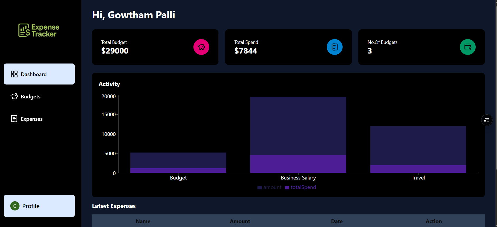

# Expense Tracker

A simple and intuitive web application for tracking your personal expenses. Easily add, view, and manage your income and spending, and get a real-time overview of your financial health.

**Live Demo:** [expense-tracker-hni12oubx-gowtham-pallis-projects.vercel.app](https://expense-tracker-hni12oubx-gowtham-pallis-projects.vercel.app)

## Features

- **Add Expense:** Record expenses with descriptions and amounts.
- **View Expenses History:** See a list of all your past transactions.
- **Balance Overview:** Instantly see your current no of budgets, total income, and total expenses.
- **Delete Transactions:** Remove unwanted entries from your transaction list.
- **Responsive Design:** Works seamlessly on desktop and mobile devices.

## Screenshots

<!-- Add screenshots here if available -->





## Getting Started

### Prerequisites

- [Node.js](https://nodejs.org/) (v14 or higher recommended)
- [npm](https://www.npmjs.com/) (comes with Node.js)

### Installation

1. **Clone the repository:**
    ```
    git clone https://github.com/your-username/expense-tracker.git
    cd expense-tracker
    ```

2. **Install dependencies:**
    ```
    npm install
    ```

3. **Start the development server:**
    ```
    npm start
    ```

4. **Open in your browser:**  
   Visit `http://localhost:3000` to use the app.

## Usage

1. **Add a Transaction:**  
   Enter a description and amount, and click "Add Expense" for a specific budget.

2. **View Balance:**  
   The top section shows your current no.of budgets, total income, and total expenses.

3. **Delete a Transaction:**  
   Click the delete (Trash) button next to any Expense to remove it.

## Technologies Used

- **Frontend:** Next.js, Tailwind
- **Deployment:** Vercel

## Author

- **Gowtham Palli**  
  [GitHub](https://github.com/gowtham-palli)  
  [LinkedIn](https://www.linkedin.com/in/gowtham-palli/)

